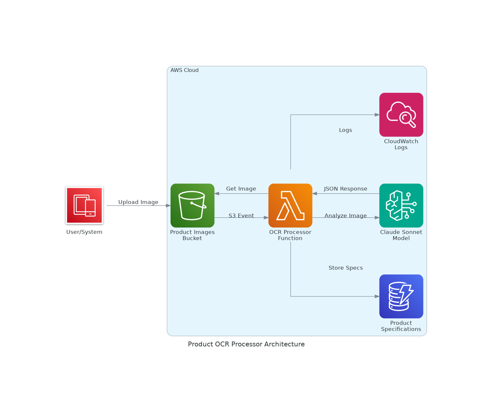

# Product OCR Processor

AWS serverless product OCR processor using S3, Lambda, Bedrock Claude, and DynamoDB for automated product specification extraction from images.

## Architecture



## Overview

This system implements a serverless event-driven architecture on AWS that automatically processes product images to extract specifications using AI-powered OCR. When a product image is uploaded to an S3 bucket, it triggers a Lambda function that uses AWS Bedrock's Claude model to analyze the image and extract structured product information, which is then stored in DynamoDB.

## Features

- **Automated Processing**: Images uploaded to S3 automatically trigger OCR processing
- **AI-Powered Extraction**: Uses AWS Bedrock Claude Sonnet model for intelligent product analysis
- **Flexible Storage**: DynamoDB schema accommodates various product types and attributes
- **Secure**: Implements least-privilege IAM policies and encryption at rest
- **Scalable**: Serverless architecture scales automatically with demand
- **Monitored**: CloudWatch logging for debugging and audit trails

## AWS Services Used

- **Amazon S3**: Storage for product images with event notifications
- **AWS Lambda**: Serverless compute for image processing logic
- **Amazon Bedrock**: AI service providing Claude model for image analysis
- **Amazon DynamoDB**: NoSQL database for flexible product specification storage
- **Amazon CloudWatch**: Logging and monitoring
- **AWS IAM**: Security and access management

## Project Structure

```
product-ocr-processor-1759434139589/
├── specs/                          # Project specifications
│   ├── requirements.md            # User stories and acceptance criteria
│   ├── design.md                  # Technical architecture and design
│   └── tasks.md                   # Implementation plan and tasks
├── cdk-app/                       # CDK infrastructure code
│   ├── lib/
│   │   └── cdk-app-stack.ts       # Main CDK stack definition
│   ├── bin/
│   │   └── cdk-app.ts             # CDK app entry point
│   └── package.json               # Dependencies and scripts
├── generated-diagrams/            # Architecture diagrams
│   └── product-ocr-architecture.png
└── VitaminTabs.jpeg              # Sample product image for testing
```

## Deployment

### Prerequisites

- AWS CLI configured with appropriate permissions
- Node.js and npm installed
- AWS CDK CLI installed (`npm install -g aws-cdk`)

### Deploy the Infrastructure

1. Navigate to the CDK app directory:
   ```bash
   cd cdk-app
   ```

2. Install dependencies:
   ```bash
   npm install
   ```

3. Build the project:
   ```bash
   npm run build
   ```

4. Deploy the stack:
   ```bash
   npx cdk deploy --require-approval never
   ```

### Test the System

1. Upload a product image to the S3 bucket:
   ```bash
   aws s3 cp your-product-image.jpg s3://product-images-1759434139589/
   ```

2. Check the Lambda function logs:
   ```bash
   aws logs describe-log-groups --log-group-name-prefix "/aws/lambda/ocr-processor-1759434139589"
   ```

3. Query the DynamoDB table for results:
   ```bash
   aws dynamodb scan --table-name product-specifications-1759434139589
   ```

## Data Schema

The DynamoDB table stores extracted product specifications with the following schema:

```json
{
  "image_id": "string (partition key)",
  "processing_timestamp": "string (sort key)",
  "source_bucket": "string",
  "source_key": "string",
  "product_specifications": {
    "product_name": "string",
    "brand": "string",
    "category": "string",
    "specifications": "object (flexible)",
    "confidence_score": "number"
  },
  "processing_status": "string",
  "error_message": "string (optional)"
}
```

## Example Output

For a vitamin product image, the system might extract:

```json
{
  "product_name": "Vitamin C 250 mg",
  "brand": "Amazon Basics",
  "category": "Dietary Supplement",
  "specifications": {
    "dosage": "250 mg per serving",
    "flavor": "Orange Flavor with Other Natural Flavors",
    "form": "Gummies",
    "quantity": "300 gummies",
    "package_type": "Value pack (2 bottles)",
    "dietary_features": ["Vegetarian", "Gluten-Free"]
  },
  "confidence_score": 0.95
}
```

## Security

- S3 bucket with server-side encryption
- DynamoDB with encryption at rest
- Lambda function with minimal IAM permissions
- Secure service-to-service communication
- No hardcoded credentials

## Monitoring

- CloudWatch logs for Lambda function execution
- CloudWatch metrics for performance monitoring
- Error handling with structured logging
- Dead letter queue for failed processing

## Cost Optimization

- Pay-per-request DynamoDB billing
- Lambda functions only run when triggered
- S3 lifecycle policies for image retention
- Bedrock usage optimized with appropriate timeouts

## Cleanup

To remove all resources:

```bash
cd cdk-app
npx cdk destroy
```

## Contributing

This project follows specification-driven development. See the `specs/` directory for detailed requirements, design, and implementation plans.

## License

This project is provided as-is for demonstration purposes.